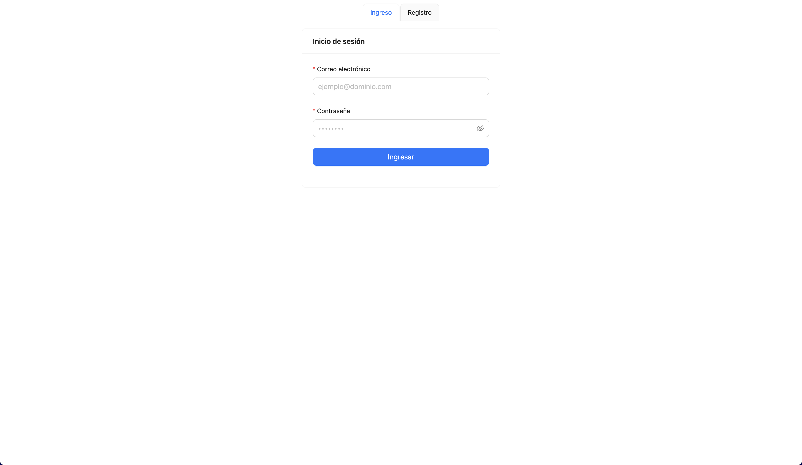
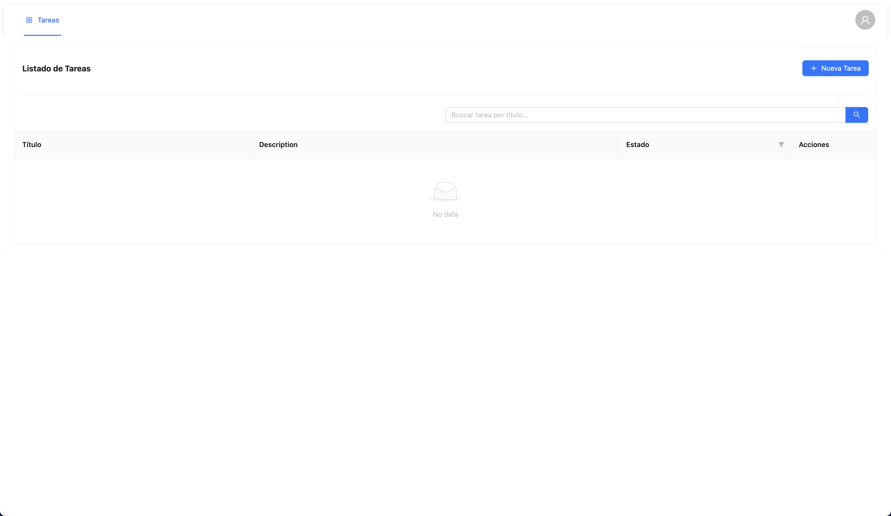

# Vue 3 + TypeScript + Vite + Pinia

## WEB Task

## Authentication



## Home



## Description

This project use this repo for api-server

```bash
$ git clone https://github.com/bakamedi/api-clean-task.git
```

Framework Vue repository of Web TASK.
```bash
src/                           # Código fuente principal
├── api/                       # Comunicación con APIs externas
│   ├── adapters/              # Adaptadores para transformar datos del backend
│   └── services/              # Servicios que hacen peticiones HTTP
│
├── core/
│   └── router/                # Configuración del enrutador
│       ├── index.ts           # Punto de entrada del router
│       ├── route-names.ts     # Nombres constantes de rutas
│       └── router.ts          # Definición de rutas y navegación
│
├── modules/                   # Módulos funcionales divididos por dominio
│   ├── auth/                  # Lógica de autenticación
│   │   ├── components/        # Componentes específicos del módulo
│   │   ├── composables/       # Composables reutilizables de auth
│   │   ├── stores/            # Estado global (ej. Pinia)
│   │   └── types/             # Tipos TypeScript relacionados
│   │
│   ├── profile/               # Módulo de perfil de usuario
│   │   ├── components/        # Componentes relacionados al perfil
│   │   ├── composables/       # Lógica reutilizable
│   │   ├── stores/            # Estado relacionado al perfil
│   │   ├── types/             # Tipos del módulo
│   │   └── task/              # Submódulo o funcionalidad relacionada a tareas
│
├── shared/                    # Recursos reutilizables en toda la app
│   ├── assets/                # Imágenes, íconos, etc.
│   ├── components/            # Componentes UI comunes (ej. Header.vue)
│   ├── composables/           # Composables globales (hooks)
│   ├── plugins/               # Configuración e instalación de plugins
│   └── types/                 # Tipos TypeScript globales
│
├── App.vue                    # Componente raíz
├── main.ts                    # Punto de arranque de la aplicación
├── style.css                  # Estilos globales
└── vite-env.d.ts              # Tipos personalizados para el entorno Vite
```

# The Project use Ant-Design for the UI Components

```bash
$ https://www.antdv.com/components/overview
```

## Create env
### Can you see the example in the file env.example

```bash
$ VITE_API_URL= //For the backend api
```

## Project setup

```bash
$ yarn install
```

## Compile and run the project

```bash
# development
$ yarn run dev
o
$ vite

# production mode
$ yarn build
$ vite build
```